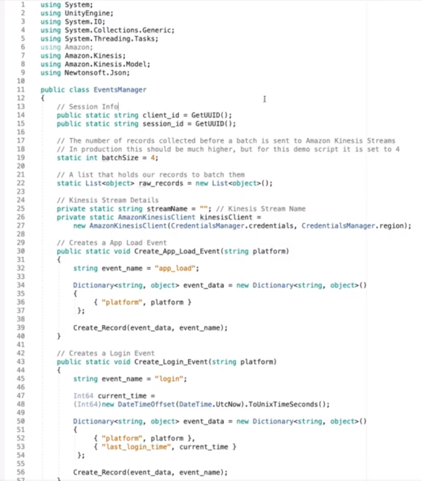
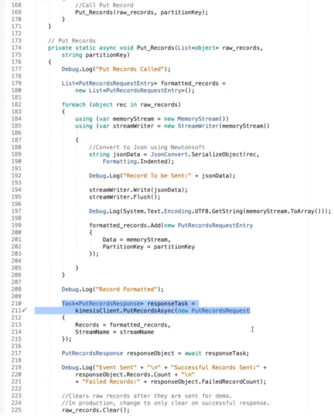
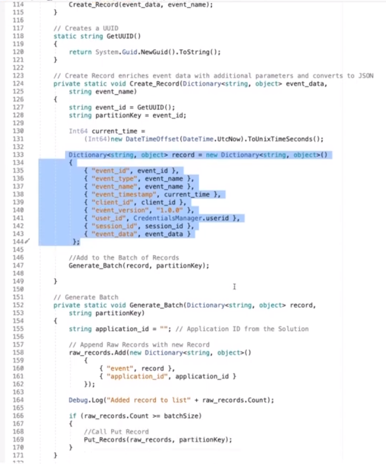

# STEPS

* Visual Studio > Project > Manage Nuggets > `AWSSDK.Core` & `AWSSDK.Kinesis`
* Tutorial Code \

* AWS Management Console > Cloud Formation > Stack > Outputs > `GameEventStream` & `TestApplicationId`
* Visual Studio > Code: streamName = `GameEventStream` & Code: application_id = `TestApplicationId`